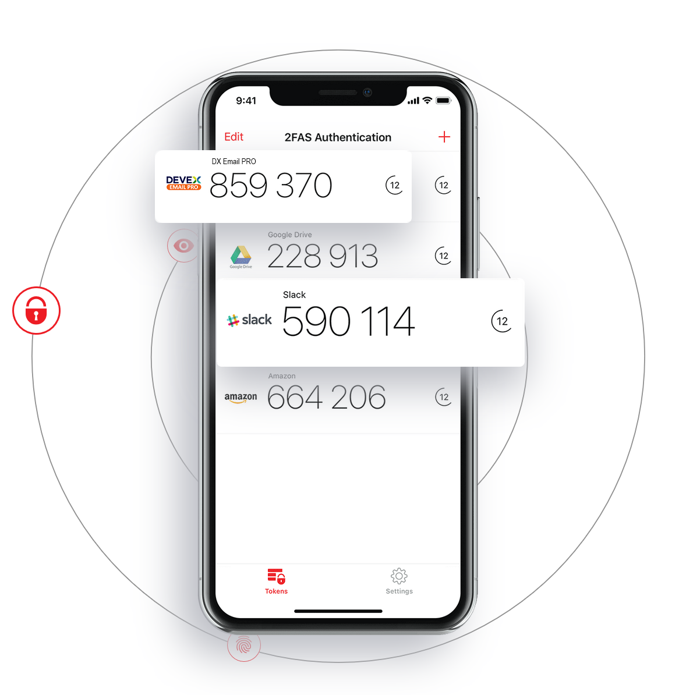
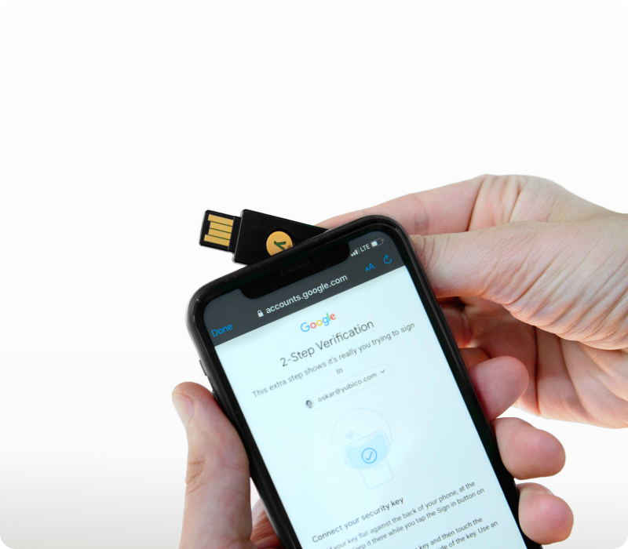
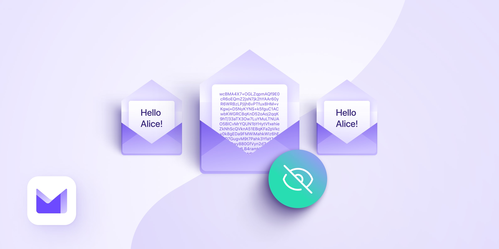
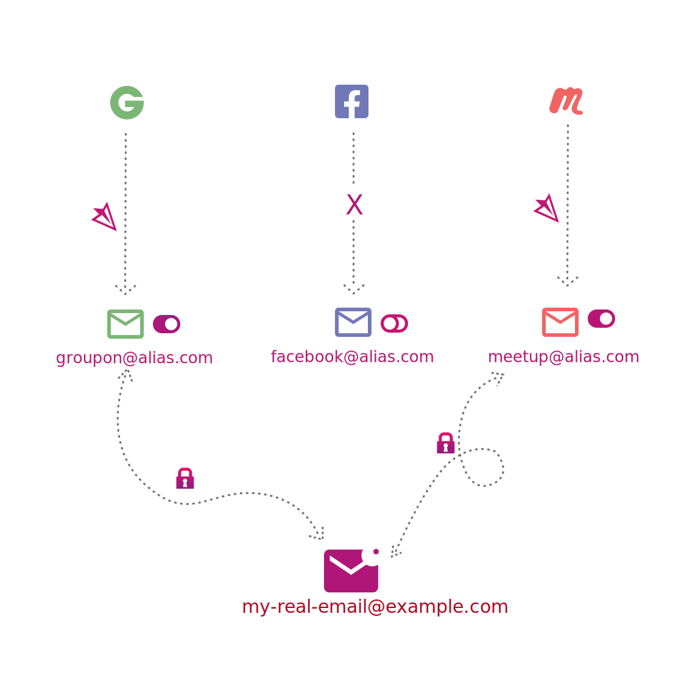
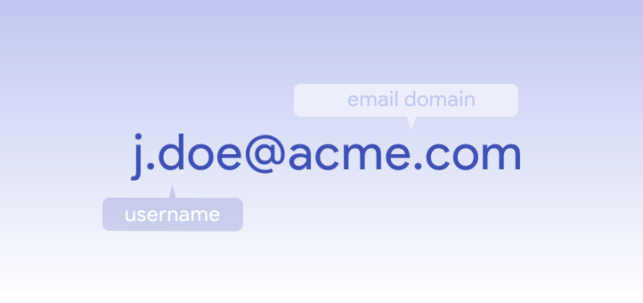
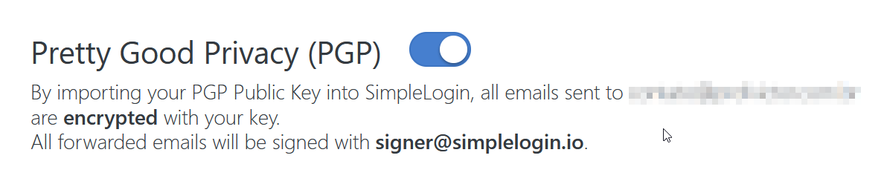
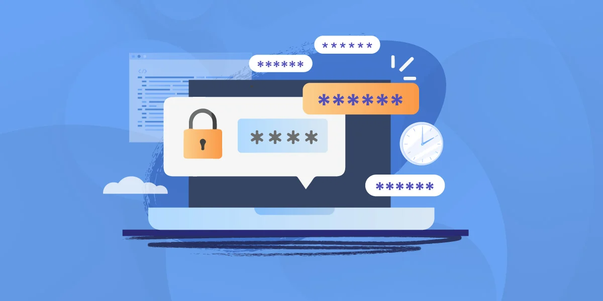
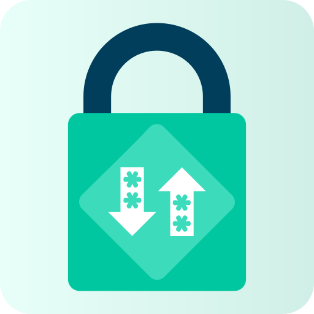
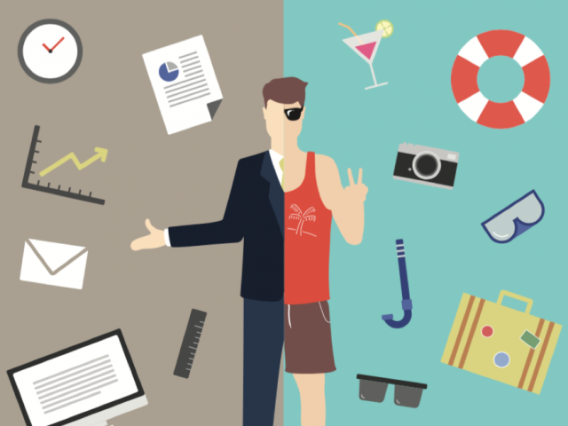

# Digital Hygiene

## Overview

- Getting Started
  - Install a Time-based One Time Password (TOTP) app
  - Register for a brand new end-to-end encrypted (E2EE) e-mail account
  - Register with an e-mail aliasing service
  - Register for a password manager
  - Import all your passwords
- Sorting through your accounts
  - In future
  - Merge duplicates
  - Delete the account if you no longer need it
  - Change your password
  - Enable MFA
  - Improve your privacy settings
  - Use an e-mail alias
  - Migrate away from "Sign in with..."
  - Update payment information
  - Update address information
- Protect your phone number
- De-Google your life

## Getting Started

Here follows my best-attempt method for getting started with a more private & secure digital life. I have included recommendations for services I understand to be solid choices but I personally have stuck with the **Proton** suite of products, since it means my actual e-mail address is not shared with anyone except **Proton**, plus that their ***Unlimited*** pricing tier includes full use of **Proton Mail**, **Pass**, **Drive**, **VPN**, **Calendar** as well as **SimpleLogin**.

### 1. Install a Time-based One Time Password (TOTP) app

[](#1-install-a-time-based-one-time-password-totp-app)

Install a TOTP app on your device. This will be a vital tool for securing your accounts later on and is the next best alternative after physical hardware security keys like [Yubikey](https://www.yubico.com).

[](https://www.yubico.com) 

Many password managers allow for keeping these codes together with your account passwords, though experts disagree on whether it is wise to utilise these features. Personally, I would advise against this as you lose the benefits of using multifactor authentication were your password manager to become compromised.

#### Alternatives

##### Open Source

- [2FAS](https://2fas.com) (iOS & Android) - Allows for one-click autofill by use of the *[optional]* tunnel browser extension
- [Aegis](https://getaegis.app) (Android)
- [FreeOTP](https://freeotp.github.io/) (iOS & Android)

##### Closed Source

- [Authy](https://authy.com/) (iOS & Android)
- Google Authenticator ([iOS](https://apps.apple.com/us/app/google-authenticator/id388497605) & [Android](https://play.google.com/store/apps/details?id=com.google.android.apps.authenticator2&hl=en&gl=US))*
- [Microsoft Authenticator](https://www.microsoft.com/en-ww/security/mobile-authenticator-app?SilentAuth=1&wa=wsignin1.0) (iOS & Android)*

> \* Personally, I would recommend against using a closed source offering from one of the [Big Five](https://en.wikipedia.org/wiki/Big_Tech) to maintain better control over your own data

### 2. Register for a brand new end-to-end encrypted (E2EE) e-mail account

Switching e-mail providers can seem like a daunting prospect but, when combined with a password manager and e-mail aliasing, can be done systematically and is then fairly straightforward to put aside if things get busy and pick up when time frees up again.

[<p align="center"></p>](https://pr.tn/ref/XRYC0YW7X370)

When registering for this new account, pick a brand new username that you have never used anywhere before and preferably one that would be hard to guess/associate with you. Avoid including personal information like your name or birth year.

Use a strong password that you will be able to remember and set up 2FA using your TOTP app or, even better, a hardware security key like [Yubikey](https://www.yubico.com). These are important factors to properly secure your account but, since your data will now be encrypted against these credentials, losing them will mean losing access to your e-mails, even if you were regain access to your account.

Avoid using any quick import features/auto-forwarding as not to associate your new e-mail with your old e-mail.

#### Alternatives

##### Open Source

- [ProtonMail](https://pr.tn/ref/XRYC0YW7X370)
- [Tutanota](https://tutanota.com)
- [StartMail](https://www.startmail.com/)

#### Account/Data Recovery

If going with **Proton**, make sure to [enable a recovery phrase](https://proton.me/support/set-account-recovery-methods#how-to-enable-a-recovery-phrase) that you can use in the eventuality you must recover your account. Not only will this grant you access to your account, it will also mean that you can access all your e-mails/data. Other providers will most likely offer an equivalent option.

Additionally, you may consider [adding a recovery e-mail address](https://proton.me/support/set-account-recovery-methods#how-to-add-or-change-a-recovery-email-address) but, again, don't use your old e-mail address for this. A good option is using the e-mail address of a loved one, ideally one who also uses E2EE e-mail.

### 3. Register with an e-mail aliasing service

[](https://simplelogin.io)

At least with **Proton Mail**, you can create a couple of aliases directly in their e-mail service. I would recommend creating one of these to use when registering with a dedicated alias service, unless going with **Proton**/**SimpleLogin**, as to not expose your actual e-mail address/username to anyone but your e-mail provider.

If you opt for **SimpleLogin** and are already using **Proton Mail** you can simply log in with your **Proton** account. Otherwise, set a strong password & enable 2FA, but make sure the password is different from the one you used with your e-mail provider. You will change this password once you have set up a password manager.

#### Alternatives

##### Open Source

- [SimpleLogin](https://simplelogin.io)
- [AnonAddy](https://anonaddy.com)
- [Firefox Relay](https://relay.firefox.com)

##### Closed Source

- [Apple Hide My E-mail](https://support.apple.com/en-us/HT210425)

#### Custom domains

There is a case to be made both for and against using a custom domain with your e-mails. If you do opt to go with a custom domain, there are a wide variety of domain registrars to choose from, however my personal favourite is [Gandi](https://gandi.net), since they support Norway's `*.no` [TLD](https://en.wikipedia.org/wiki/Top-level_domain).

[](#custom-domains)

##### Pros

- One-time setup for data breach alerts from [have i been pwned?](https://haveibeenpwned.com/DomainSearch). Don't have to individually add every alias
- Can much easier switch e-mail provider/e-mail aliasing service at any time

##### Cons

- Less anonymity since you must associate your personal information with a domain provider *(though many domain registrars allow for anonymising your personal information from showing up in [WHOIS](https://en.wikipedia.org/wiki/WHOIS) lookups)*
- More likely to stand out from the crowd

#### PGP Encryption

At this point, if your aliasing service allows for it, I would strongly recommend setting up PGP encryption between your e-mail provider and your aliasing service to protect against man-in-the-middle attacks between these two points. You can also add contacts' PGP keys against their aliases in **SimpleLogin** to prevent against such attacks from end-to-end.

[<p align="left"></p>](#pgp-encryption)

### 4. Register for a password manager

[<p align="center"></p>](#4-register-for-a-password-manager)

Using a password manager has several benefits. Firstly, you no longer have to remember all of your login details for every single service you use. E-mail addresses, usernames, passwords & more can be saved and associated with a website in your password manager. This allows you to take advantage of the second benefit - generating unique, complex passwords for each website you use. This greatly reduces the attack surface *when*, not if, one of your passwords is leaked, since the password is now only good for the compromised site, not your Facebook, e-mail or bank accounts too. You can install your password manager's app on your phone, add add their extension to your browser - this will then automatically fill your username & password on any website you use.

Most password managers support autofilling not only username, passwords & TOTPs, but also personal information like name, address, passport and credit card information. You can add all of these into your password manager to save having to fish out your credit card or passport any time you go to purchase something/register for a flight.

#### Alternatives

##### Open Source

- [Proton Pass](https://proton.me/pass)*
- [Bitwarden](https://bitwarden.com)
- [KeePassXC](https://keepassxc.org)

> \* Proton Pass is a very new offering from Proton and, as such, is not as mature as some of the others. It is remarkably feature-complete for something not even a month old, but I would probably recommend sticking with Bitwarden for the time being.

##### Closed Source

- [1Password](https://1password.com)
- [Dashlane](https://www.dashlane.com)

#### Register

For all combinations other than **Proton** + **Proton Pass**, you will need to create a new account. This is the first service you can use your e-mail aliasing service to generate an alias for. (e.g. bitwarden.2k7ys@mydomain.com).

Set a new, strong password that you will be able to remember and enable 2FA. This password and the password to your e-mail provider are the only two passwords you will need to remember in future.

Once you've signed up, you can install the browser extension for your password manager and log in to it. You can also install the desktop & mobile apps at this point.

#### Add the password for your e-mail aliasing service

Once you're set up, you can add your first password - click *Add* or *New* to add a new login, then enter the URL for your e-mail aliasing service, the username/e-mail you registered with there and the password you entered there at sign up.

You can then immediately navigate to your e-mail aliasing service, log in using your password manager's autofill and use your password manager to generate a new, much stronger password to use here. Make sure you are prompted to overwrite the existing password.

### 5. Import all your passwords

[](#5-import-all-your-passwords)

Now you can import any saved passwords from all of your devices & browsers. It is really important to make sure you have retrieved as many passwords as it is possible to get out of any and all browsers you use (Chrome, Firefox, Brave, Edge, Opera, ...), across all your devices (desktop PC, laptop, phone, tablet...). Some password managers also have the facility to import accounts from your e-mail.

Password import guides for each of the aforementioned providers are listed here:

- [Proton Pass: How to import to Proton Pass](https://proton.me/support/pass-import)
- [Bitwarden: Import Data to your Vault](https://bitwarden.com/help/import-data)
- [KeePassXC: Importing External Databases](https://keepassxc.org/docs/KeePassXC_UserGuide#_importing_external_databases)
- [1Password: Move your data from other applications to 1Password](https://support.1password.com/import)
- [Dashlane: Import your data into Dashlane](https://support.dashlane.com/hc/en-us/articles/360004101920-Import-your-data-into-Dashlane)

## Sorting through your accounts

Now comes the tedious part. Having laid the foundations for a more secure future, it's time to wade through your existing accounts. For each account in your password manager, follow the steps laid out below. Remember that this is a marathon, not a sprint. It typically takes several weeks to get through all your accounts but this is thankfully a one-time process.

Try to set a goal of doing all of the accounts under a letter of the alphabet each time you sit down to attack it, or getting through 10 accounts a day or whatever you find achievable. The most important thing is to keep going; better that it take 6 months but you get through the list than getting 10% of the way through and giving up.

### 0. In future

First and foremost; the best measure you can take to keep your personal information from being misused is to never have given it out in the first place. This can be good to keep in the back of your mind whenever you go to sign up to new apps or services in future, to save yourself the hassle of having to go through and delete or secure accounts like this again.

### 1. Merge duplicates

If you find you have multiple records for a single account, try to identify which combination of username/password is correct and manually merge these duplicate records into one. Do not get overzealous here, if you are unsure, assume you have multiple accounts that you will individually need to deal with.

### 2. Delete the account if you no longer need it

Decide whether you really need the account any more.

Even if you think you may use the service again, ask yourself whether you specifically need *this* account - could you just create a new account were you to use the service again or do you need the data that is against specifically this account (e.g. order history/receipts)?

If you feel you can get rid of the account, you can try to delete it. You can do this by either:

- Logging into the account and trying to find a button specifically using the word **Delete**. Do not be fooled by *Close* or *Deactivate*. These are NOT equivalent. In some rare cases, they may perform the same function, but better safe than sorry. If you are unable to locate this button, it's over to the alternative.

- Following link to the company's **Privacy Policy**. This can typically be found at the bottom of their homepage. In the privacy policy, find the section that applies to the GDPR "Right to be forgotten"/"Right to deletion"/similar. Here you will find either a link to a web form you can fill out specifically requesting a GDPR deletion or, more likely, an privacy-specific e-mail address you can send a request to. This typically looks something like dpo@company.com, privacy@company.com or gdpr@company.com. Some companies simply use their customer service e-mail address. You can then proceed to send the following e-mail;

  ```markdown
    To: privacy@company.com
    Subject: Account Deletion

    Please delete my account and all associated personal information in accordance with GDPR.
  ```

In either case, if the account was not immediately deleted, mark the account as having **requested deletion** in your password manager, either by renaming it (eg. `onlineshop.com` -> `REQUESTED DELETION: someonlineshop.com`, moving it to a folder dedicated to items pending deletion or adding a custom field; `Requested deletion: [x]`

### 3. Change your password

One of the major benefits to having a password manager is that you no longer need to remember passwords yourself. This means that you no longer have to reuse the 1, 5 or even 10 passwords you rotate on various websites, but instead can use a unique password for every account you have. This greatly reduces the impact were one of these accounts to be compromised since the password is not reused on any other sites.

> NB. Using e-mail aliases is a way to amplify this effect, since not only would each account have a unique password, but also a unique e-mail address, rendering this information practically useless to bad actors.

Moreover, these unique passwords will be far more resilient to brute-force attacks, since you can make them as long & complicated as your password manager allows.

Set up your password manager's default password generation to:

- Be as many characters as possible
- Use both capital and lower case letters
- Use numbers
- Use symbols
- Use similar characters

This will result in passwords that look something like this:

`YjXysQzJukRn9hTwtyz8u%tcgydRSkh^N5eSaB$>Q6SQvfu+rqKxa3x(Buh$b*!e`

You may need to adjust these settings down for websites that may not use best practices when it comes to passwords (e.g. Only accepting passwords up to 20 characters and no special characters), but it's best to do this on a case-by-case basis, rather than having it be the default.

Log in to the account and navigate to the change password. Some websites may instead require you to follow the *Forgot password* link on the login page. You can now use your password manager to generate a new password to replace the one associated with the account. Make sure you are prompted to update the password for this account.

### 4. Enable MFA

Multifactor Authentication (MFA) is one of the best measures you can take to secure your online accounts, as it introduces the need for a second piece of login information to be able to log in. It is worth noting that not all multifactor authentication is created equal;

- **S tier**: Hardware security keys (e.g. Yubikey)
- **A tier**: Time-based One Time Passwords (TOTP)
- **B tier**: Trusted device confirmation (e.g. app/web notification)
- **C tier**: E-mail confirmation (e.g. e-mailed code/"magic" link)
- **D tier**: SMS codes

Enable the highest option on this list available to you. This will often mean scanning a QR-code with your TOTP app and entering the code it generates.

Often, you will subsequently be presented with a list of backup codes. These can be saved to your password manager as a custom field on the account or as a separate note called something like `SomeOnlineShop | 2FA Backup Codes`. If you are not presented with these codes, they are typically available as an individual security option you can set up in your account's security settings.

### 5. Improve your privacy settings

Since you are now anyway logged in to the account, this is an ideal time to go through the various security & privacy settings and make sure everything looks good. I found myself typically turning off/opting out of multiple privacy settings. Often these settings were not limited to the **Privacy** section of the menu, either, but tucked away in some other menu. For example, what elements of your profile are visible to the public on LinkedIn.

Facebook was by far and away the worst offender here. Multiple UIs, disjointed menus and sneaky hidden settings mean that you should be prepared for a fight, but the best thing is to just delete your Facebook account if you can.

### 6. Use an e-mail alias

Use your e-mail aliasing service to generate a new alias for the current account.

Ideally, include a randomly-generated suffix such that your e-mail addresses can't simply be guessed by using the company name and your domain. This also makes your aliases easier to regenerate should the need arise. For example:

`facebook.2j49f@mydomain.com`

Using an alias like this, especially in combination with something like [have i been pwned?](https://haveibeenpwned.com), means that you will be able to directly pinpoint who is guilty in selling or leaking your information. You may even know about a leak before they do!

### 7. Migrate away from "Sign in with..."

As with almost this entire guide, this is down to personal choice, but in my view; with unique passwords/e-mail addresses, the benefit of using a third party identity provider is somewhat moot.

Whilst you are entrusting credentials to the service you sign into when using a traditional e-mail/password combination, since both your e-mail address and password are now entirely unique to each individual service, the damage is isolated were one of these services to be compromised. It also means that, were your Google/Apple/Microsoft account to be compromised, the hacker would not gain access to any services you sign into using this account.

Always signing in with a unique e-mail address can help maintain a clear picture of what you have signed up for, as well as a fine-grained control over account access.

Look for settings referring to *Social Connections*/*Social Login*/similar. Here you should simply be able to select **Unlink** to remove the connection with the identity provider.

### 8. Update payment information

Saving your credit card information on various sites puts it at risk of being leaked. Wherever possible, use a service such as Apple Pay or Vipps to abstract your payment information away from the site you are buying something from. Virtual credit cards from sites like [privacy.com](https://privacy.com) are currently only available in the US, but Apple Pay/Vipps perform an analagous, if not **more** secure, function - providing one-time use payment details at checkout.

Remove any saved credit card information from the account if possible.

### 9. Update address information

On sites you regularly use and have secured, it can be a good idea to ensure that your address information is up-to-date, so that things get delivered to your current address.

## Separating work & home

[](#separating-work--home)

Hopefully your job provides you with a password manager but even if not, it can be a good idea to separate out logins/information associated with work to a completely separate password manager account. You can use your work e-mail address to sign up to this and it is yet another way to minimise your attack surface. It can also help to keep work and home life separate, since you can optionally only log in to your work password manager on your work devices, for example.

## Protect your phone number

[](#protect-your-phone-number)

Reserve your phone number from being used by third parties/shown on sites like [1881.no](https://1881.no)

### Telenor

Gå til "Reservasjon mot nummervisning" på [Mine sider](https://www.telenor.no/mine-sider)

### Telia

[Reservasjon mot bruk av personopplysninger](https://www.telia.no/personvern/reservasjon-mot-bruk-av-personopplysninger)

### Gule Sider

Logg inn [her](https://oppdater.gulesider.no/person) med BankID for å fjerne din informasjon fra Gule Sider

## De-Google your life

[<p align=center></p>](#de-google-your-life)

Whilst this section references Google, the following really applies to any non-privacy-friendly services you may use, Big Tech or otherwise.

I used Gmail, so much of my data consequently ended up with Google. Photos, Drive, Search & Maps were all services I heavily relied on.

### TOTP

> eg. Google Authenticator, Microsoft Authenticator

[See TOTP recommendations further up in this guide](#1-install-a-time-based-one-time-password-totp-app).

### E-mail

> eg. Gmail, Outlook

[See e-mail provider recommendations further up in this guide](#2-register-for-a-brand-new-end-to-end-encrypted-e2ee-e-mail-account).

### E-mail Aliasing

> eg. Apple HideMyEmail

[See e-mail aliasing recommendations further up in this guide](#3-register-with-an-e-mail-aliasing-service).

### Password Manager

> eg. Google Password Manager/Chrome, Microsoft Edge, Apple iCloud KeyChain etc.

[See password manager recommendations further up in this guide](#4-register-for-a-password-manager).

### Drive

> eg. Google Drive, Microsoft OneDrive, Apple iCloud Drive, Dropbox

At a minimum, reduce the number of providers that you have entrusted with your data down to one or two. Ideally find a provider that supports end-to-end encryption(E2EE), such as [Proton Drive](https://proton.me/drive).

Alternatively you could export your data to your own offline storage solution.

### Photos

> eg. Google Photos, Apple iCloud Photos, Facebook

- [NextCloud](https://nextcloud.com)

### Notes

> eg. Google Keep, Microsoft OneNote, Apple iCloud Notes, Evernote

- [Joplin](https://joplinapp.org/)

### News

> eg. Google News, Apple News, Reddit

RSS Readers

### Productivity/Office Suite

> eg. Google Docs, Microsoft Office, Apple iWork

- [LibreOffice](https://www.libreoffice.org)
- [Open Office](https://www.openoffice.org)
- [Only Office](https://www.onlyoffice.com)
- [NextCloud](https://nextcloud.com)

### Search Engine

> eg. Google Search, Microsoft Bing

- [StartPage](https://www.startpage.com)
- [DuckDuckGo](https://duckduckgo.com)
- [Ecosia](https://www.ecosia.org)

### Maps

> eg. Google Maps, Apple Maps

- [Organic Maps](https://organicmaps.app)
- [OsmAnd](https://osmand.net)
- [MAPS.ME](https://maps.me)
- [Magic Earth](https://www.magicearth.com)

### Translate

> eg. Google Translate

### Keyboards

> eg. Gboard, SwiftKey

### Home Automation

> eg.Google Home, Apple HomeKit, Amazon Alexa

- [Home Assistant](https://www.home-assistant.io)
- [openHAB](https://www.openhab.org)
- [Homey](https://homey.app)

### Sign in with

> eg. Google, Apple, Microsoft, GitHub
