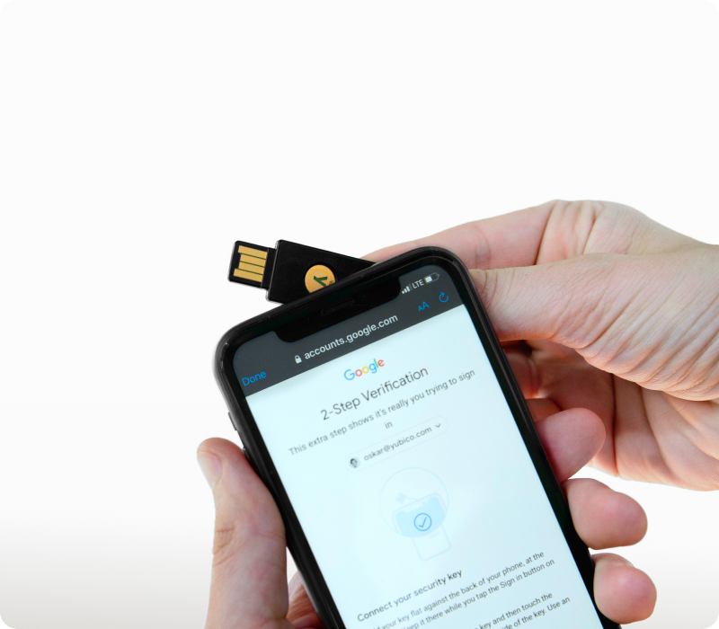
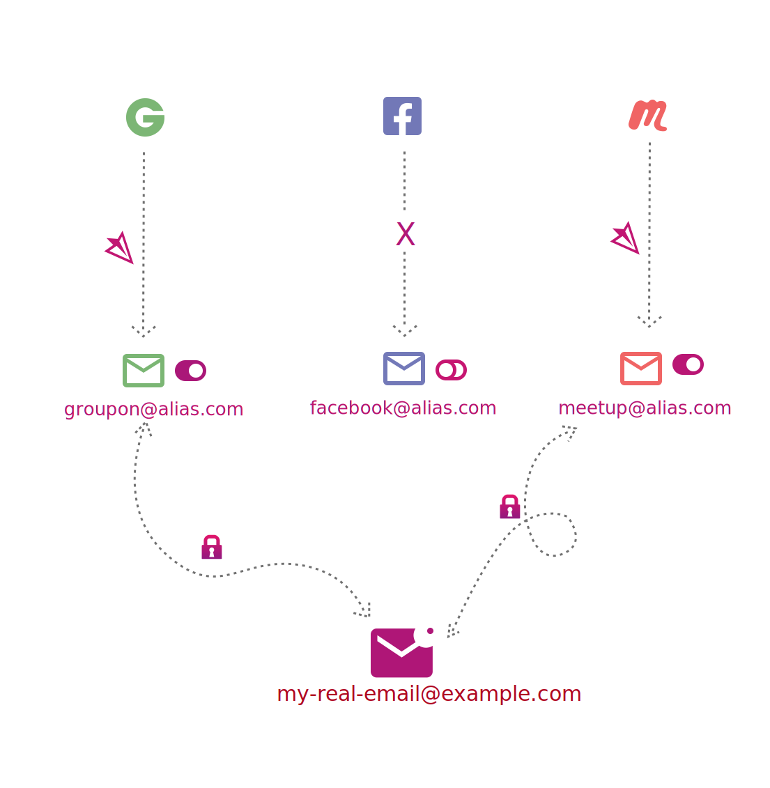
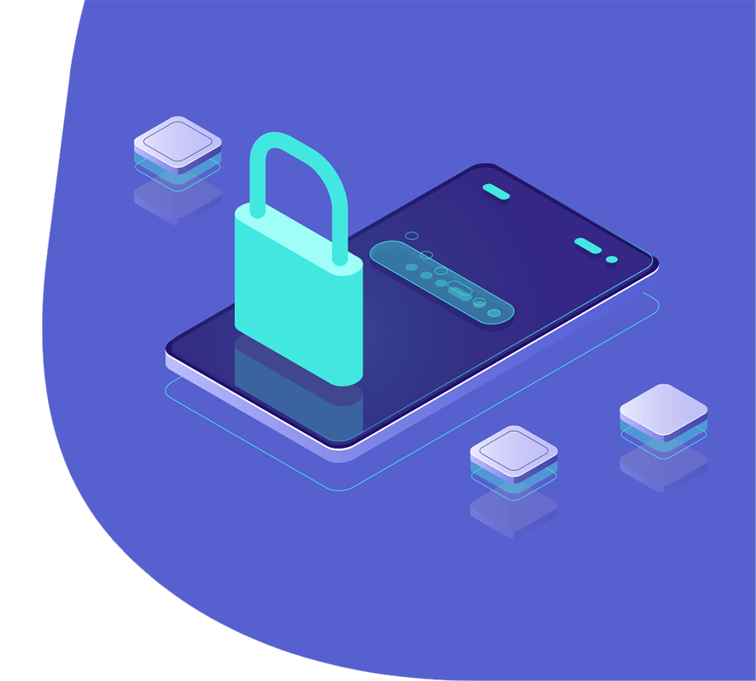

# Getting Started

Here follows my best-attempt method for getting started with a more private & secure digital life. I have included recommendations for services I understand to be solid choices but I personally have stuck with the **Proton** suite of products, since it means my actual e-mail address is not shared with anyone except **Proton**, plus that their ***Unlimited*** pricing tier includes full use of **Proton Mail**, **Pass**, **Drive**, **VPN**, **Calendar** as well as **SimpleLogin**.

## Contents

- [Install a Time-based One Time Password (TOTP) app](#1-install-a-time-based-one-time-password-totp-app)
- [Register for a brand new end-to-end encrypted (E2EE) e-mail account](#2-register-for-a-brand-new-end-to-end-encrypted-e2ee-e-mail-account)
- [Register with an e-mail aliasing service](#3-register-with-an-e-mail-aliasing-service)
- [Register for a password manager](#4-register-for-a-password-manager)
- [Import all your passwords](#5-import-all-your-passwords)
- [Merge duplicated](#6-merge-duplicates)
- [Protect your phone number](#7-protect-your-phone-number)

## 1. Install a Time-based One Time Password (TOTP) app

Install a TOTP app on your device. This will be a vital tool for securing your accounts later on and is the next best alternative after physical hardware security keys like [Yubikey](https://www.yubico.com).

Many password managers allow for keeping these codes together with your account passwords, though experts disagree on whether it is wise to utilise these features. Personally, I would advise against this as you lose the benefits of using multifactor authentication were your password manager to become compromised.

### Alternatives

#### Open Source

- [2FAS](https://2fas.com) (iOS & Android) - Allows for one-click autofill by use of the *[optional]* tunnel browser extension
- [Aegis](https://getaegis.app) (Android)
- [FreeOTP](https://freeotp.github.io/) (iOS & Android)

#### Closed Source

- [Authy](https://authy.com/) (iOS & Android)
- Google Authenticator ([iOS](https://apps.apple.com/us/app/google-authenticator/id388497605) & [Android](https://play.google.com/store/apps/details?id=com.google.android.apps.authenticator2&hl=en&gl=US))*
- [Microsoft Authenticator](https://www.microsoft.com/en-ww/security/mobile-authenticator-app?SilentAuth=1&wa=wsignin1.0) (iOS & Android)*

> \* Personally, I would recommend against using a closed source offering from one of the [Big Five](https://en.wikipedia.org/wiki/Big_Tech) to maintain better control over your own data

## 2. Register for a brand new end-to-end encrypted (E2EE) e-mail account

Switching e-mail providers can seem like a daunting prospect but, when combined with a password manager and e-mail aliasing, can be done systematically and is then fairly straightforward to put aside if things get busy and pick up when time frees up again.

[

](https://pr.tn/ref/XRYC0YW7X370)

When registering for this new account, pick a brand new username that you have never used anywhere before and preferably one that would be hard to guess/associate with you. Avoid including personal information like your name or birth year.

Use a strong password that you will be able to remember and set up 2FA using your TOTP app or, even better, a hardware security key like [Yubikey](https://www.yubico.com). These are important factors to properly secure your account but, since your data will now be encrypted against these credentials, losing them will mean losing access to your e-mails, even if you were regain access to your account.

Avoid using any quick import features/auto-forwarding as not to associate your new e-mail with your old e-mail.

### Alternatives

#### Open Source

- [ProtonMail](https://pr.tn/ref/XRYC0YW7X370)
- [Tutanota](https://tutanota.com)
- [StartMail](https://www.startmail.com/)

### Account/Data Recovery

If going with **Proton**, make sure to [enable a recovery phrase](https://proton.me/support/set-account-recovery-methods#how-to-enable-a-recovery-phrase) that you can use in the eventuality you must recover your account. Not only will this grant you access to your account, it will also mean that you can access all your e-mails/data. Other providers will most likely offer an equivalent option.

Additionally, you may consider [adding a recovery e-mail address](https://proton.me/support/set-account-recovery-methods#how-to-add-or-change-a-recovery-email-address) but, again, don't use your old e-mail address for this. A good option is using the e-mail address of a loved one, ideally one who also uses E2EE e-mail.

## 3. Register with an e-mail aliasing service

At least with **Proton Mail**, you can create a couple of aliases directly in their e-mail service. I would recommend creating one of these to use when registering with a dedicated alias service, unless going with **Proton**/**SimpleLogin**, as to not expose your actual e-mail address/username to anyone but your e-mail provider.

If you opt for **SimpleLogin** and are already using **Proton Mail** you can simply log in with your **Proton** account. Otherwise, set a strong password & enable 2FA, but make sure the password is different from the one you used with your e-mail provider. You will change this password once you have set up a password manager.

### Alternatives

#### Open Source

- [SimpleLogin](https://simplelogin.io)
- [AnonAddy](https://anonaddy.com)
- [Firefox Relay](https://relay.firefox.com)

#### Closed Source

- [Apple Hide My E-mail](https://support.apple.com/en-us/HT210425)

### have i been pwned?

[have i been pwned?](https://haveibeenpwned.com) is a free service that will alert you if any of your e-mail addresses have been leaked in a data breach.

With a single e-mail address, the process of signing up for alerts is very simple - simply enter your e-mail on their website, click subcribe and verify the link sent to your inbox.

With tens to hundreds of e-mail aliases, however the process is a little different. **SimpleLogin** integrates with [have i been pwned?](https://haveibeenpwned.com)'s APIs to alert you if any of your aliases have been leaked, however other aliasing services may not. If they don't, it can be a good idea to get a custom domain and use the [Domain search feature](https://haveibeenpwned.com/DomainSearch) from [have i been pwned](https://haveibeenpwned.com), as detailed below.

### Custom domains

There is a case to be made both for and against using a custom domain with your e-mails. If you do opt to go with a custom domain, there are a wide variety of domain registrars to choose from, however my personal favourite is [Gandi](https://gandi.net), since they support Norway's `*.no` [TLD](https://en.wikipedia.org/wiki/Top-level_domain).

#### Pros

- One-time setup for data breach alerts via [have i been pwned?](https://haveibeenpwned.com)'s [Domain search](https://haveibeenpwned.com/DomainSearch). No need to individually register each alias
- Can much easier switch e-mail provider/e-mail aliasing service at any time

#### Cons

- Less anonymity since you must associate your personal information with a domain provider *(though many domain registrars allow for anonymising your personal information from showing up in [WHOIS](https://en.wikipedia.org/wiki/WHOIS) lookups)*
- More likely to stand out from the crowd

### PGP Encryption

At this point, if your aliasing service allows for it, I would strongly recommend setting up PGP encryption between your e-mail provider and your aliasing service to protect against man-in-the-middle attacks between these two points. You can also add contacts' PGP keys against their aliases in **SimpleLogin** to prevent against such attacks from end-to-end.

[

](#pgp-encryption)

## 4. Register for a password manager

[

](#4-register-for-a-password-manager)

Using a password manager has several benefits. Firstly, you no longer have to remember all of your login details for every single service you use. E-mail addresses, usernames, passwords & more can be saved and associated with a website in your password manager. This allows you to take advantage of the second benefit - generating unique, complex passwords for each website you use. This greatly reduces the attack surface *when*, not if, one of your passwords is leaked, since the password is now only good for the compromised site, not your Facebook, e-mail or bank accounts too. You can install your password manager's app on your phone, add add their extension to your browser - this will then automatically fill your username & password on any website you use.

Most password managers support autofilling not only username, passwords & TOTPs, but also personal information like name, address, passport and credit card information. You can add all of these into your password manager to save having to fish out your credit card or passport any time you go to purchase something/register for a flight.

### Alternatives

#### Open Source

- [Proton Pass](https://proton.me/pass)*
- [Bitwarden](https://bitwarden.com)
- [KeePassXC](https://keepassxc.org)

> \* Proton Pass is a very new offering from Proton and, as such, is not as mature as some of the others. It is remarkably feature-complete for something not even a month old, but I would probably recommend sticking with Bitwarden for the time being.

#### Closed Source

- [1Password](https://1password.com)
- [Dashlane](https://www.dashlane.com)

### Register

For all combinations other than **Proton** + **Proton Pass**, you will need to create a new account. This is the first service you can use your e-mail aliasing service to generate an alias for. (e.g. bitwarden.2k7ys@example.com).

Set a new, strong password that you will be able to remember and enable 2FA. This password and the password to your e-mail provider are the only two passwords you will need to remember in future.

Once you've signed up, you can install the browser extension for your password manager and log in to it. You can also install the desktop & mobile apps at this point.

### Add the password for your e-mail aliasing service

Once you're set up, you can add your first password - click *Add* or *New* to add a new login, then enter the URL for your e-mail aliasing service, the username/e-mail you registered with there and the password you entered there at sign up.

You can then immediately navigate to your e-mail aliasing service, log in using your password manager's autofill and use your password manager to generate a new, much stronger password to use here. Make sure you are prompted to overwrite the existing password.

## 5. Import all your passwords

Now you can import any saved passwords from all of your devices & browsers. It is really important to make sure you have retrieved as many passwords as it is possible to get out of any and all browsers you use (Chrome, Firefox, Brave, Edge, Opera, ...), across all your devices (desktop PC, laptop, phone, tablet...). Some password managers also have the facility to import accounts from your e-mail.

It can be a good idea to try to think of accounts that you may never have logged into through these browsers; older accounts or apps on your phone, for example. If these aren't present after having imported saved passwords from all your browsers, add them manually, even if you can't remember the password. You can always make use of the **Forgot your password** button on these sites later on.

Password import guides for each of the aforementioned providers are listed here:

- [Proton Pass: How to import to Proton Pass](https://proton.me/support/pass-import)
- [Bitwarden: Import Data to your Vault](https://bitwarden.com/help/import-data)
- [KeePassXC: Importing External Databases](https://keepassxc.org/docs/KeePassXC_UserGuide#_importing_external_databases)
- [1Password: Move your data from other applications to 1Password](https://support.1password.com/import)
- [Dashlane: Import your data into Dashlane](https://support.dashlane.com/hc/en-us/articles/360004101920-Import-your-data-into-Dashlane)

## 6. Merge duplicates

If you find you have multiple records for a single account (eg. one record for [messenger.com](https://messenger.com) and a separate one for [facebook.com](https://facebook.com)), try to identify which of these has the most up-to-date password and manually merge these duplicate records into one.

Sometimes you may find that you have multiple records for a single site/related sites with different usernames or a username on one and an e-mail address on another. These can also be merged, but don't get overzealous here. If you are unsure, assume you have multiple accounts that you will individually need to deal with.

Eliminating duplicates will make the subsequent process of reviewing your accounts a fair bit simpler.

## 7. Protect your phone number

Reserve your phone number from being used by third parties/shown on sites like [1881.no](https://1881.no)

### Telenor

Gå til "Reservasjon mot nummervisning" på [Mine sider](https://www.telenor.no/mine-sider)

### Telia

Gå til [Reservasjon mot bruk av personopplysninger](https://www.telia.no/personvern/reservasjon-mot-bruk-av-personopplysninger)

### Gule Sider

Logg inn [her](https://oppdater.gulesider.no/person) med BankID for å fjerne din informasjon fra Gule Sider
