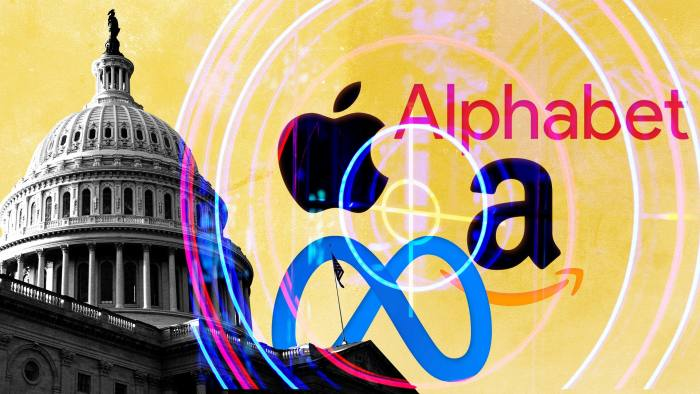
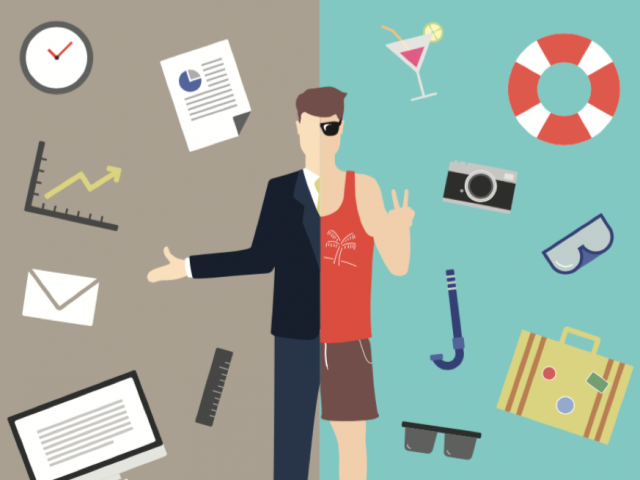

# Next Steps

## Contents

- [De-Google your life](#de-google-your-life)
- [Separating work & home](#separating-work--home)

## De-Google your life

[

](#de-google-your-life)

Whilst this section references Google, the following really applies to any non-privacy-friendly services you may use, Big Tech or otherwise. If you use an iPhone, your photos are most likely tied up in Apple's iCloud. Google Maps has become the defacto standard for navigation. Simply browsing the web lets Google build up a worringly accurate profile about you. We don't even need to start on why Facebook is an absolute dumpster fire...

Below you will find some open source & privacy-friendly alternatives to some of the most commonly utilised services in our everyday.

### TOTP

> eg. Google Authenticator, Microsoft Authenticator

[See TOTP recommendations further under **Getting Started**](../01-getting-started/README.md#1-install-a-time-based-one-time-password-totp-app)

### E-mail

> eg. Gmail, Outlook

[See e-mail provider recommendations under **Getting Started**](../01-getting-started/README.md#2-register-for-a-brand-new-end-to-end-encrypted-e2ee-e-mail-account)

### E-mail Aliasing

> eg. Apple HideMyEmail

[See e-mail aliasing recommendations ubder **Getting Started**](../01-getting-started/README.md#3-register-with-an-e-mail-aliasing-service)

### Password Manager

> eg. Google Password Manager/Chrome, Microsoft Edge, Apple iCloud KeyChain etc.

[See password manager recommendations further up in this guide](#4-register-for-a-password-manager).

### Drive

> eg. Google Drive, Microsoft OneDrive, Apple iCloud Drive, Dropbox

At a minimum, reduce the number of providers that you have entrusted with your data down to one or two.

Try to switch to a provider that supports end-to-end encryption(E2EE), such as [Proton Drive](https://proton.me/drive) or make use of something like [Cryptomator](https://cryptomator.org/) to encrypt your files before entrusting them to Google or Microsoft.

Alternatively you could export your data to your own offline storage solution.

### Photos

> eg. Google Photos, Apple iCloud Photos, Facebook

- [NextCloud](https://nextcloud.com)

### Notes

> eg. Google Keep, Microsoft OneNote, Apple iCloud Notes, Evernote

- [Joplin](https://joplinapp.org/)

### News

> eg. Google News, Apple News, Reddit

RSS Readers

### Productivity/Office Suite

> eg. Google Docs, Microsoft Office, Apple iWork

- [LibreOffice](https://www.libreoffice.org)
- [Open Office](https://www.openoffice.org)
- [Only Office](https://www.onlyoffice.com)
- [NextCloud](https://nextcloud.com)

### Search Engine

> eg. Google Search, Microsoft Bing

- [StartPage](https://www.startpage.com)
- [DuckDuckGo](https://duckduckgo.com)
- [Ecosia](https://www.ecosia.org)

### Maps

> eg. Google Maps, Apple Maps

- [Organic Maps](https://organicmaps.app)
- [OsmAnd](https://osmand.net)
- [MAPS.ME](https://maps.me)
- [Magic Earth](https://www.magicearth.com)

### Translate

> eg. Google Translate

### Keyboards

> eg. Gboard, SwiftKey

### Home Automation

> eg.Google Home, Apple HomeKit, Amazon Alexa

- [Home Assistant](https://www.home-assistant.io)
- [openHAB](https://www.openhab.org)
- [Homey](https://homey.app)

### Sign in with

> eg. Google, Apple, Microsoft, GitHub

## Separating work & home

As part of importing your passwords, you may have found that several work accounts have made their way into your password manager. In an ideal world, your job provides you with a password manager, but even if not, it can be a good idea to separate out logins/information associated with work to a completely separate password manager account.

If you can't get work to pay for this, then [Bitwarden](https://bitwarden.com) has a more than adequate free tier. You can use your work e-mail address to sign up here and it is yet another way to minimise your attack surface. It can also help to keep work and home life separate, since you could, for example, only log in to your work password manager on work devices.
